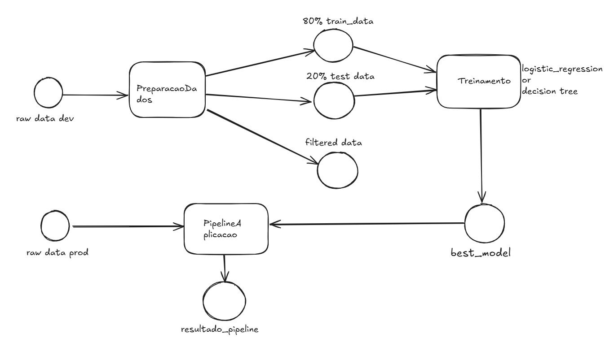

# Trabalho de Engenharia de Machine Learning 
## Esse trabaho foi desenvolvido em um enviroment do python 3.11
## Resposta questão 2


## Resposta questão 3
Rastreamento de experimentos: MLflow registra experimentos, métricas e versões, enquanto PyCaret simplifica o log automático dentro de seu fluxo de treinamento.

Funções de treinamento: Scikit‑Learn fornece os algoritmos e estruturas básicas; PyCaret abstrai o processo para facilitar a comparação e otimização dos modelos.

Monitoramento da saúde do modelo: Streamlit cria dashboards interativos para visualização em tempo real; MLflow fornece logs e métricas históricas para análise.

Atualização de modelo: Uma abordagem integrada (com MLflow e pipelines de retreinamento via PyCaret/Scikit‑Learn) permite retreinamentos reativos e programados, assegurando que o modelo se mantenha aderente aos dados atuais.

Provisionamento (Deployment): MLflow formata e empacota os modelos para deployment; Streamlit pode servir como interface interativa para demonstração e monitoramento, e os modelos do Scikit‑Learn podem ser integrados facilmente em APIs ou serviços de produção

## Resposta questão 4

Artefatos	                        

/data/raw/dataset_kobe_dev      	
Arquivo Parquet com registros brutos de arremessos “dev”. Contém todas as colunas       originais (posicionamento, tempo, informações de jogo, variáveis de contexto etc.).

/data/raw/dataset_kobe_prod     	
Arquivo Parquet com registros brutos de arremessos “prod”. Mesma estrutura do dataset dev, porém coletado em outro período ou ambiente.

data_filtered	                    
Arquivo Parquet contendo apenas as colunas selecionadas (lat, long, minutes_remaining, period, playoffs, shot_distance, shot_made_flag) e sem linhas faltantes.

base_train      	                
Parquet com 80% dos registros de data_filtered, estratificados pela coluna shot_made_flag. Usado para ajuste (fit) dos modelos.

base_test       	                
Parquet com 20% dos registros de data_filtered, estratificados pela coluna shot_made_flag. Usado para avaliação final dos modelos.

modelo_final.pickle                 
Pickle contendo o melhor modelo que foi escolhido entre um decision tree e um logistic 
regression

resultado_pipeline                  
Parquet com o resultado da inferência na base de produção

## Resposta questão 6 alternativa e
O melhor modelo foi escolhido com base na performance da função de custo log loss 

## Resposta questão 7
Foi demonstrado um endpoint de predição no notebook mlflow_serv servido pelo comando
mlflow models serve -m models:/trained_model/latest --env-manager=local --port 5001 --no-conda   

## Resposta questão 7 alternativa a
O modelo não foi aderente a base de produção. Ele foi treinado com uma seleção das features que podem não representar
o evento. A métrica score caiu muito, por consequência o modelo teve dificuldade em predizer a classe 1 - made shot.
A distribuição da base de teste as classes estão quase iguais e na produção  está praticamente 65/35 que pode ser
um sinal de que os dados estão sofrendo label drift

## Resposta questão 7 alternativa b
Acompanhamento de métricas periódicas  de log loss, F1, acurácia
Monitorar a distribuição das features em tempo real vs baseline

## Resposta questão 7 alternativa c

Reativa
Análise das métricas em produção pioram (log loss, F1) ou há drift detectado.
Coletar dados recentes com rótulos, reexecuta pipeline e promove novo modelo.

Preditiva (Programada)
Análise (mensal, trimestral) ou a cada X novos registros.
refaz todo processo: processamento, treino, avaliação e promoção.


[](https://kedro.org)

## Overview

This is your new Kedro project, which was generated using `kedro 0.19.12`.

Take a look at the [Kedro documentation](https://docs.kedro.org) to get started.

## Rules and guidelines

In order to get the best out of the template:

* Don't remove any lines from the `.gitignore` file we provide
* Make sure your results can be reproduced by following a [data engineering convention](https://docs.kedro.org/en/stable/faq/faq.html#what-is-data-engineering-convention)
* Don't commit data to your repository
* Don't commit any credentials or your local configuration to your repository. Keep all your credentials and local configuration in `conf/local/`

## How to install dependencies

Declare any dependencies in `requirements.txt` for `pip` installation.

To install them, run:

```
pip install -r requirements.txt
```

## How to run your Kedro pipeline

You can run your Kedro project with:

```
kedro run
```

## How to test your Kedro project

Have a look at the files `src/tests/test_run.py` and `src/tests/pipelines/data_science/test_pipeline.py` for instructions on how to write your tests. Run the tests as follows:

```
pytest
```

To configure the coverage threshold, look at the `.coveragerc` file.

## Project dependencies

To see and update the dependency requirements for your project use `requirements.txt`. You can install the project requirements with `pip install -r requirements.txt`.

[Further information about project dependencies](https://docs.kedro.org/en/stable/kedro_project_setup/dependencies.html#project-specific-dependencies)

## How to work with Kedro and notebooks

> Note: Using `kedro jupyter` or `kedro ipython` to run your notebook provides these variables in scope: `catalog`, `context`, `pipelines` and `session`.
>
> Jupyter, JupyterLab, and IPython are already included in the project requirements by default, so once you have run `pip install -r requirements.txt` you will not need to take any extra steps before you use them.

### Jupyter
To use Jupyter notebooks in your Kedro project, you need to install Jupyter:

```
pip install jupyter
```

After installing Jupyter, you can start a local notebook server:

```
kedro jupyter notebook
```

### JupyterLab
To use JupyterLab, you need to install it:

```
pip install jupyterlab
```

You can also start JupyterLab:

```
kedro jupyter lab
```

### IPython
And if you want to run an IPython session:

```
kedro ipython
```

### How to ignore notebook output cells in `git`
To automatically strip out all output cell contents before committing to `git`, you can use tools like [`nbstripout`](https://github.com/kynan/nbstripout). For example, you can add a hook in `.git/config` with `nbstripout --install`. This will run `nbstripout` before anything is committed to `git`.

> *Note:* Your output cells will be retained locally.

## Package your Kedro project

[Further information about building project documentation and packaging your project](https://docs.kedro.org/en/stable/tutorial/package_a_project.html)
